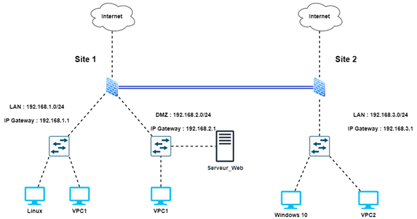
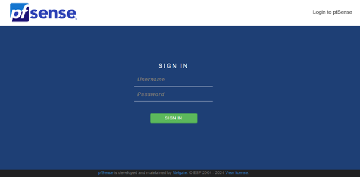
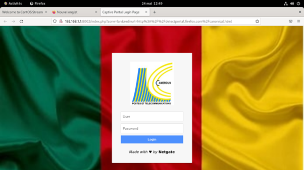
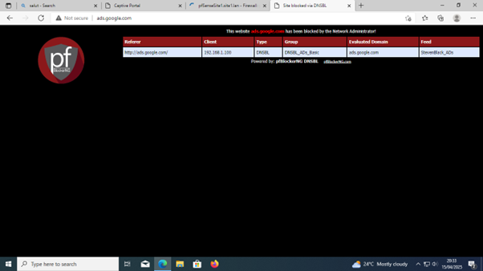
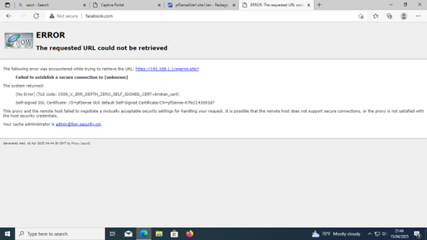

# 🔐 Configuration Sécurisée de pfSense - Projet de Simulation Réseau

Ce projet décrit l’installation, la configuration et la sécurisation d’une infrastructure réseau basée sur **pfSense**, un pare-feu open source puissant. Le déploiement a été effectué dans un environnement virtualisé (GNS3) à des fins pédagogiques.

---

## 📌 Sommaire

- [Introduction à pfSense](#introduction-à-pfsense)
- [Architecture réseau](#architecture-réseau)
- [Étapes de configuration](#étapes-de-configuration)
  - [Portail Captif](#1-portail-captif)
  - [Règles de Pare-feu](#2-règles-de-pare-feu)
  - [Blocage Publicités - pfBlockerNG](#3-blocage-publicités---pfblockerng)
  - [Filtrage Web - Squid et SquidGuard](#4-filtrage-web---squid-et-squidguard)
  - [Intrusion Prevention System - Snort](#5-intrusion-prevention-system---snort)
  - [VPN Site-à-Site (IPsec)](#6-vpn-site-à-site-ipsec)
- [Configuration minimale requise](#configuration-minimale-requise)

---

## 🛡 Introduction à pfSense

**pfSense** est un pare-feu basé sur FreeBSD offrant des fonctionnalités avancées :
- Filtrage de paquets
- NAT, VPN (IPsec, OpenVPN)
- Contrôle de la bande passante
- Portail captif
- Système de détection/prévention d’intrusion (IDS/IPS)

---

## 🌐 Architecture Réseau

Une architecture simple à double interface :
- **WAN** (Internet)
- **LAN** (Réseau interne avec postes clients)

L’interface Web est accessible uniquement via LAN pour des raisons de sécurité.

---

## ⚙️ Étapes de Configuration

### 1. Portail Captif

Permet de restreindre l’accès au réseau :
- Interface : LAN
- Authentification : base locale
- Utilisateur : `Lion` / `admin`
- Ajout de privilège : "Connexion Portail Captif"
- Interface personnalisée (logo, image de fond)

### 2. Règles de Pare-feu

- Règles filtrantes basées sur les adresses et protocoles
- Exemple : accès SSH autorisé uniquement à l’admin LAN
- Blocage de l’accès Web à l’interface pfSense depuis le WAN

### 3. Blocage Publicités - pfBlockerNG

Utilisé pour masquer les publicités et trackers :
- Activation du DNS Resolver
- Installation du package `pfBlockerNG`
- Configuration DNSBL avec EasyList et EasyPrivacy
- Mises à jour automatiques toutes les 2 heures
- Ajout de listes personnalisées

### 4. Filtrage Web - Squid et SquidGuard

Proxy + filtrage web HTTPS/HTTP :
- Cache proxy : 1 Go
- Mode transparent (HTTP + HTTPS via SSL filtering)
- Création d’un certificat d’autorité
- Utilisation de la blacklist de l’université Toulouse Capitole
- Blocage des sites adultes, réseaux sociaux, streaming

### 5. Intrusion Prevention System - Snort

- Installation du package `Snort`
- Activation des règles communautaires (ET Open, GPLv2)
- Mises à jour journalières
- Politique utilisée : `Balanced`
- Interface configurée : WAN
- Test avec `nmap` pour détection

### 6. VPN Site-à-Site (IPsec)

Tunnel sécurisé entre deux sites distants :
- Phase 1 : IP WAN du site distant, PSK, AES 256, SHA256
- Phase 2 : sous-réseaux locaux (ex. 192.168.1.0/24 ↔ 192.168.3.0/24)
- Création des règles dans Firewall > IPsec
- Vérification du tunnel via Status > IPsec

---

## 🖥 Configuration Minimale Requise

- CPU 64-bit (x86_64)
- 1 Go RAM
- 8 Go de disque (SSD recommandé)
- 2 interfaces réseau (ou plus)

---

## 🧠 Notes

- L’ensemble de la configuration a été testé dans GNS3
- Les règles sont sensibles à leur ordre (top-down)
- pfSense offre une interface intuitive, adaptée même aux débutants

---

## 📎 Ressources utiles

- [Télécharger pfSense](https://www.pfsense.org/download/)
- [pfBlockerNG](https://docs.netgate.com/pfsense/en/latest/packages/pfblocker.html)
- [Snort IDS/IPS](https://www.snort.org/)
- [GNS3 Marketplace](https://gns3.com/marketplace/appliances)
- Rapport : *Rapport de configuration pfsense – 2024/2025*
- Rapport : *presentation de configuration pfsense – 2024/2025*

---

## 🤝 Auteurs

**Team PFSENSE**  
Projet de simulation et sécurisation réseau avec pfSense.

